<div align="center">

# 🚛 FLEETIX

### *AI-Powered Fleet Management & Logistics Intelligence Platform*

[](https://nextjs.org/)
[](https://react.dev)
[](https://www.typescriptlang.org/)
[](https://www.mongodb.com/)
[](https://ai.google/)
[](https://tailwindcss.com/)
[](LICENSE)

**The smartest fleet management platform. Plan trips with AI. Scan expenses instantly. Monitor your entire fleet in real-time.**

[🚀 Quick Start](#-quick-start-setup) • [✨ Features](#-core-features) • [🏗️ Architecture](#-system-architecture) • [🔌 API Docs](#-api-reference) • [🎯 Showcase](#-user-experience-showcase)

</div>

---

## 🎯 What is FLEETIX?

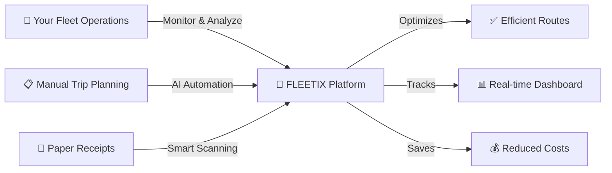

<div align="center">

### **Problem** → **Solution**
Manual trip planning wastes hours | AI-powered trip plans in seconds with Gemini
Paper receipts get lost & are error-prone | AI expense scanner auto-parses receipts
No visibility into fleet operations | Real-time dashboard with live metrics
Scattered vehicle & driver data | Centralized management with role-based access
Fuel & toll cost estimation is guesswork | AI calculates precise cost breakdowns

</div>

---

## ✨ Core Features

<table>
<tr>
<td width="50%">

### 🤖 **AI Trip Planner**
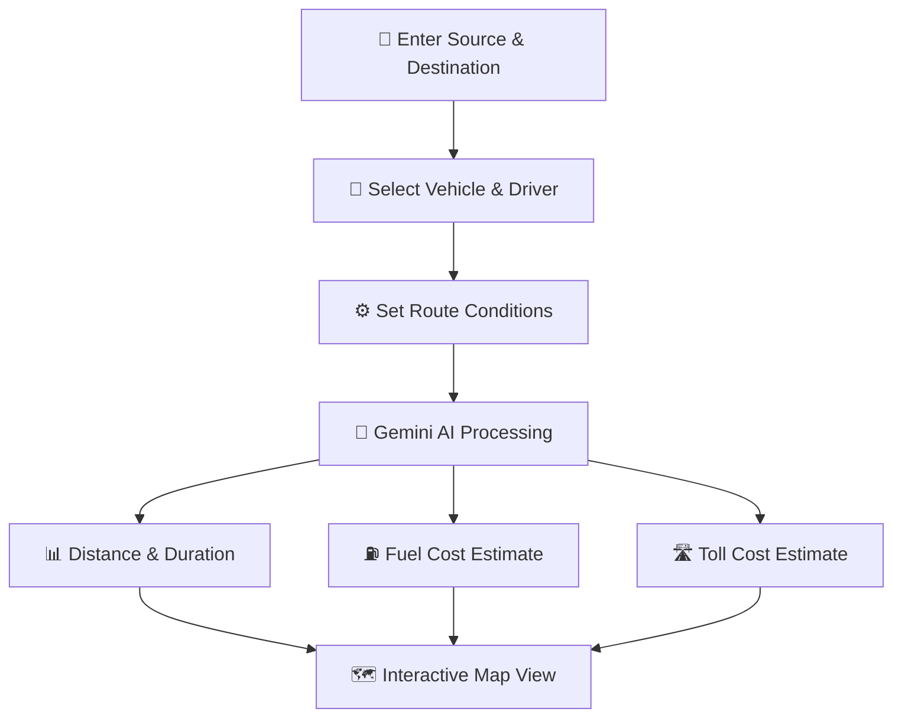

**Intelligent Route Planning:**
- ✅ AI-generated trip plans via Google Gemini
- ✅ Real-time distance & duration estimates
- ✅ Fuel cost & toll charge calculations
- ✅ Interactive Leaflet map visualization
- ✅ Route type selection (City/Highway/Mixed)
- ✅ Traffic condition awareness
- ✅ Points of interest along routes

</td>
<td width="50%">

### 🧾 **AI Expense Scanner**
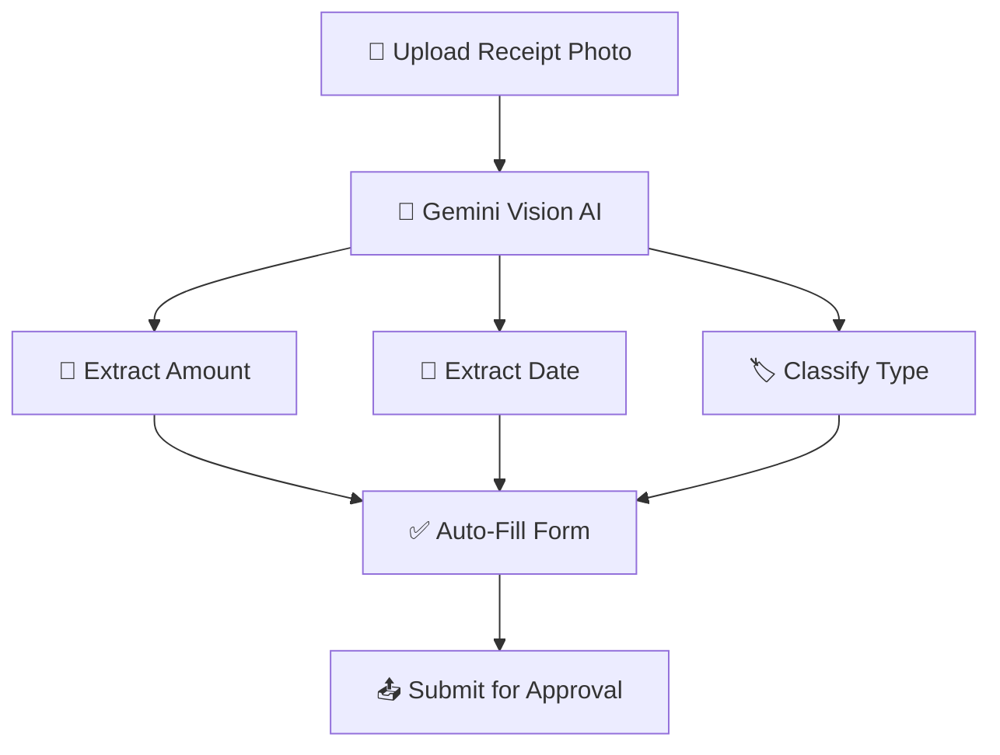

**Smart Receipt Processing:**
- 🧠 AI-powered receipt image parsing
- 📊 Automatic amount & date extraction
- 🏷️ Smart expense type classification
- 📋 Support for Fuel, Toll, Maintenance, Health
- ✅ Admin approval/rejection workflow
- 📤 Manual entry fallback option

</td>
</tr>
<tr>
<td width="50%">

### 📊 **Operations Dashboard**
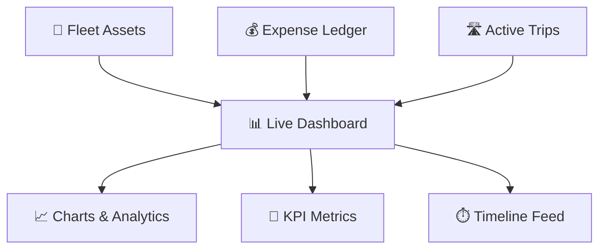

**Real-Time Fleet Intelligence:**
- 📈 Trips per vehicle bar charts
- 💰 Monthly expense trend analysis
- 🎯 Asset allocation ring visualization
- ⏱️ Live operations timeline feed
- 🔔 Anomaly registry & health checks
- 👤 Role-based views (Admin/Driver)

</td>
<td width="50%">

### 🚛 **Vehicle & Employee Management**
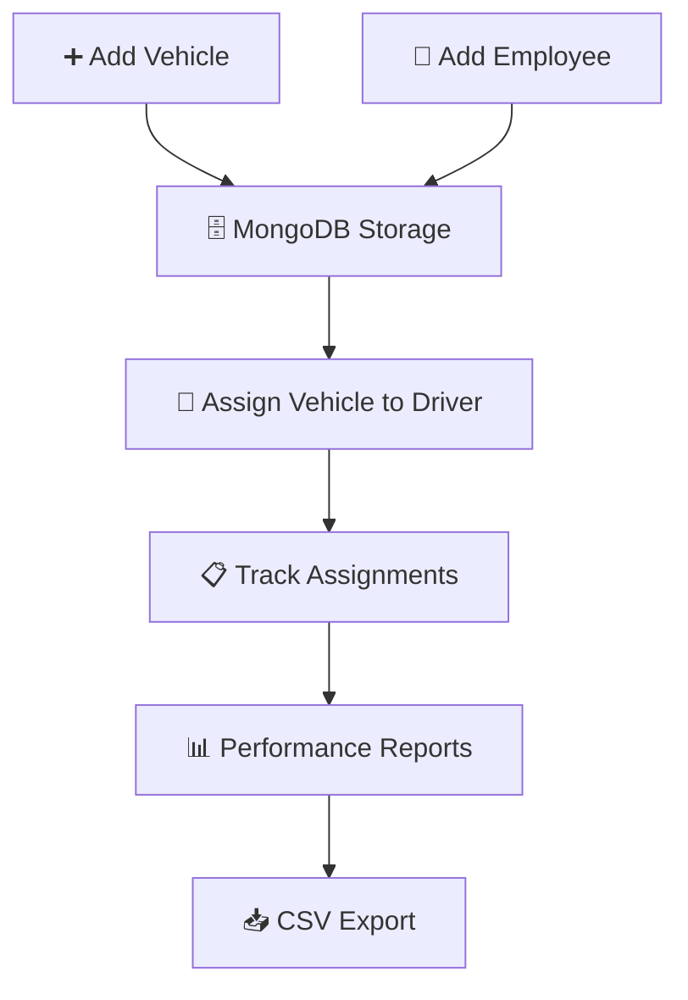

**Complete Fleet Control:**
- 🚛 Full CRUD vehicle management
- 👥 Employee profile management
- 🔗 Vehicle-to-driver assignments
- 📊 Driver performance analytics
- 📋 Expense approval workflows
- 📥 Report generation & CSV export

</td>
</tr>
<tr>
<td colspan="2" width="100%">

### 🗺️ **Routes & Emissions Tracking**
**Comprehensive Route Intelligence:**
```
┌─ Route Analysis: AI-optimized path calculation
├─ Emissions Tracking: CO₂ per km estimation
├─ Distance Records: Historical route data
├─ Route Types: Highway / City / Mixed
├─ Traffic Modes: Light / Normal / Stop & Go
├─ Fuel Efficiency: Vehicle-specific consumption
└─ Eco Tips: AI-generated driving recommendations
```

✅ Interactive maps • 📈 Emissions analytics • 🗺️ Route history • 🌿 Eco-driving insights • 📊 Carbon footprint reports

</td>
</tr>
</table>

---

## 🏗️ System Architecture

### **High-Level Flow**

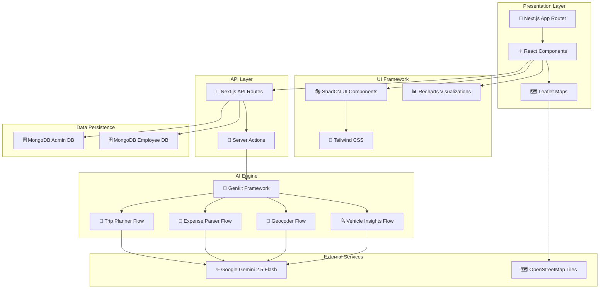

### **Technology Stack Matrix**

<table>
<tr>
<th colspan="2" align="center">⚛️ Frontend (Web UI)</th>
<th colspan="2" align="center">🔌 Backend (API & AI)</th>
<th colspan="2" align="center">🗄️ Data & Storage</th>
</tr>
<tr>
<td>Framework</td><td>Next.js 15 (App Router)</td>
<td>Runtime</td><td>Node.js</td>
<td>Database</td><td>MongoDB</td>
</tr>
<tr>
<td>UI Library</td><td>React 18</td>
<td>AI Framework</td><td>Genkit</td>
<td>Admin DB</td><td>admin_db</td>
</tr>
<tr>
<td>Language</td><td>TypeScript</td>
<td>AI Model</td><td>Google Gemini 2.5 Flash</td>
<td>Employee DB</td><td>emp_db</td>
</tr>
<tr>
<td>Styling</td><td>Tailwind CSS</td>
<td>API Style</td><td>REST (Next.js API Routes)</td>
<td>Connection</td><td>MongoDB Driver 6.x</td>
</tr>
<tr>
<td>Components</td><td>ShadCN UI + Radix</td>
<td>AI Flows</td><td>Trip Planner, Expense Parser, Geocoder</td>
<td>Collections</td><td>14+ collections</td>
</tr>
<tr>
<td>Charts</td><td>Recharts</td>
<td>Forms</td><td>React Hook Form + Zod</td>
<td>Indexing</td><td>Auto-migrations</td>
</tr>
<tr>
<td>Maps</td><td>Leaflet + React-Leaflet</td>
<td>Validation</td><td>Zod Schema</td>
<td>Backup</td><td>Manual / Scheduled</td>
</tr>
<tr>
<td>Icons</td><td>Lucide React</td>
<td>Auth</td><td>Role-based (Admin/Employee)</td>
<td>Hosting</td><td>Vercel / Firebase</td>
</tr>
</table>

---

## 🎯 User Experience Showcase

### **Admin Flow: AI Trip Planning & Assignment**

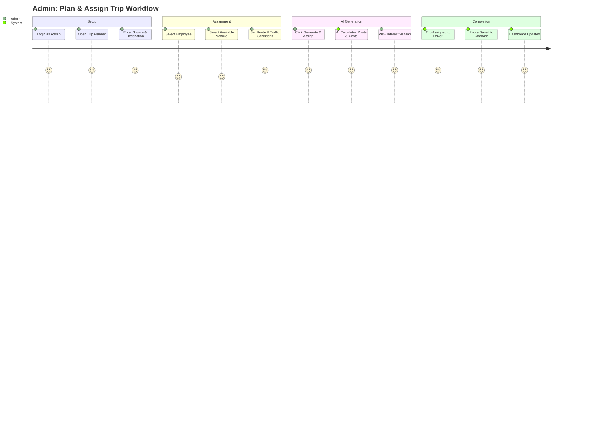

### **Driver Flow: Expense Submission & Tracking**

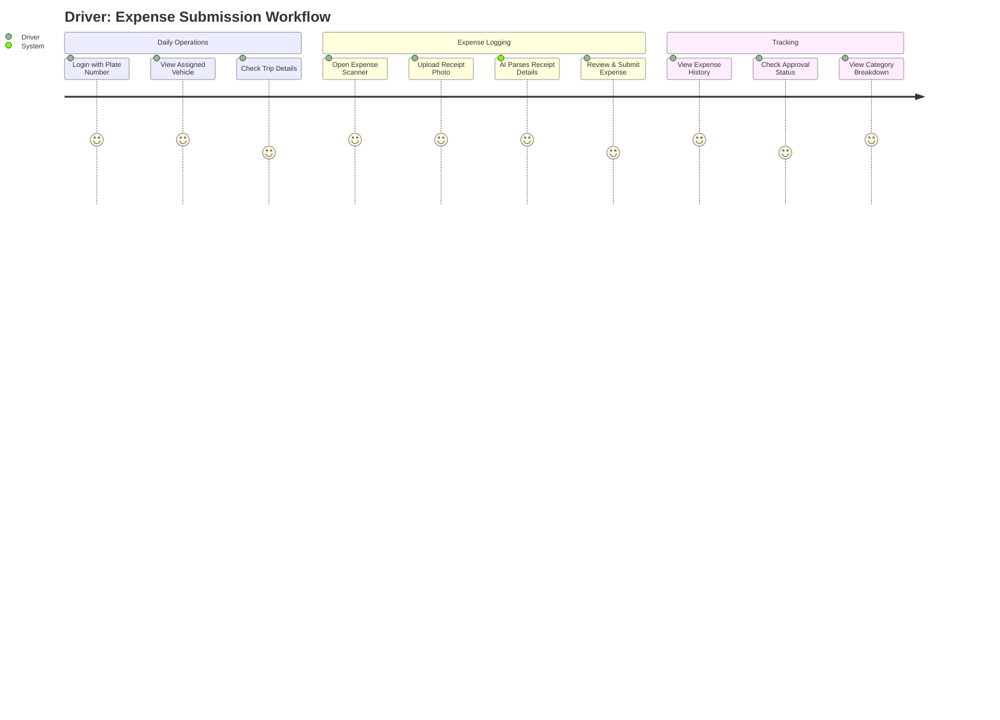

---

## 🚀 Quick Start Setup

### ⚡ **One-Command Installation**

```bash
# Clone the repository
git clone https://github.com/tawfeeq-bahur/fleet_manager.git
cd fleet_manager

# Install dependencies
npm install

# Start development server
npm run dev
```

### 📋 **Prerequisites**

```
✅ Node.js 18 or higher (download: nodejs.org)
✅ MongoDB Compass running on localhost:27017
✅ Google AI API Key (for Gemini AI features)
✅ Git (download: git-scm.com)
✅ 500MB free disk space
```

### 🛠️ **Environment Configuration**

Create a `.env.local` file in the project root:

```env
# 🤖 AI Configuration
GOOGLE_GENAI_API_KEY=your_google_ai_api_key_here

# 🗄️ MongoDB Configuration
MONGODB_URI=mongodb://localhost:27017
MONGODB_URI_ADMIN=mongodb://localhost:27017
MONGODB_URI_EMPLOYEE=mongodb://localhost:27017
MONGODB_DB_ADMIN=admin_db
MONGODB_DB_EMPLOYEE=emp_db
```

### 🎉 **Launch Application**

```bash
# Development mode (with hot reload)
npm run dev

# Production build
npm run build
npm start

# Lint & type check
npm run lint
npm run typecheck
```

**🌐 Access Points:**
- **Application:** `http://localhost:9002`
- **Genkit Dev UI:** `npx genkit start` (AI flow testing)
- **MongoDB:** `mongodb://localhost:27017` (via Compass)

### 🔐 **Default Login Credentials**

| Role | Username | Password | Admin Code |
|------|----------|----------|------------|
| **Admin** | `admin` | `123` | Any 6-digit code starting with `1` (e.g., `123456`) |
| **Driver** | Vehicle plate number (e.g., `TRK-001`) or Employee ID (e.g., `EMP001`) | `123` | — |

---

## 📊 Project Structure

```
fleet_manager/
│
├── src/                                    # 📂 Source Code
│   ├── ai/                                 # 🤖 AI Engine
│   │   ├── genkit.ts                       # Genkit configuration
│   │   ├── dev.ts                          # AI development server
│   │   └── flows/                          # AI Flow Definitions
│   │       ├── trip-planner.ts             # 🗺️ AI trip planning & cost estimation
│   │       ├── expense-parser.ts           # 🧾 AI receipt image parsing
│   │       ├── geocoder.ts                 # 📍 Location geocoding
│   │       ├── road-snapper.ts             # 🛣️ Route road-snapping
│   │       └── vehicle-insights.ts         # 🔍 AI vehicle analytics
│   │
│   ├── app/                                # 📱 Next.js App Router Pages
│   │   ├── page.tsx                        # 📊 Main dashboard (Admin & Employee views)
│   │   ├── layout.tsx                      # 🎨 Root layout with providers
│   │   ├── globals.css                     # 🎨 Global styles & design tokens
│   │   ├── login/page.tsx                  # 🔐 Authentication page
│   │   ├── guide/page.tsx                  # 🗺️ AI Trip Planner page
│   │   ├── scanner/page.tsx                # 🧾 AI Expense Scanner page
│   │   ├── vehicles/                       # 🚛 Vehicle management pages
│   │   ├── employees/                      # 👥 Employee management pages
│   │   ├── trips/page.tsx                  # 🛣️ Trip history & tracking
│   │   ├── routes/page.tsx                 # 🗺️ Route & emissions analysis
│   │   ├── reports/page.tsx                # 📈 Analytics & reports
│   │   ├── odometer/page.tsx               # 📷 Odometer reading submissions
│   │   ├── vehicle-health/page.tsx         # 🏥 Vehicle health monitoring
│   │   ├── trip-summary/page.tsx           # 📋 Trip summary details
│   │   ├── profile/page.tsx                # 👤 Employee profile page
│   │   ├── support/page.tsx                # 🆘 Support & help page
│   │   └── api/                            # 🔌 API Route Handlers
│   │       ├── admin/                      # Admin APIs (vehicles, trips, seed)
│   │       ├── employee/                   # Employee APIs (expenses, profile)
│   │       ├── employees/route.ts          # Employee CRUD operations
│   │       ├── routes/                     # Route saving & retrieval
│   │       ├── odometer/                   # Odometer submission APIs
│   │       ├── refresh-data/               # Data refresh endpoint
│   │       ├── test-connection/            # DB connection testing
│   │       ├── setup-fleet-data/           # Fleet data initialization
│   │       └── populate-all-data/          # Complete data population
│   │
│   ├── components/                         # 🧩 Reusable Components
│   │   ├── AppLayout.tsx                   # 🏠 Main layout with sidebar & state
│   │   ├── ThemeProvider.tsx               # 🌙 Dark/Light theme provider
│   │   ├── ThemeToggle.tsx                 # 🔄 Theme toggle button
│   │   ├── fleet/                          # Fleet-specific components
│   │   │   ├── FleetSummary.tsx            # 📊 KPI summary cards
│   │   │   ├── VehicleList.tsx             # 🚛 Vehicle list with actions
│   │   │   ├── AddVehicleDialog.tsx        # ➕ Add vehicle form dialog
│   │   │   ├── AddEmployeeDialog.tsx       # 👤 Add employee form dialog
│   │   │   └── MapDisplay.tsx              # 🗺️ Interactive Leaflet map
│   │   ├── assistant/                      # AI assistant components
│   │   │   └── ChatAssistant.tsx           # 💬 Chat interface
│   │   ├── odometer/                       # Odometer components
│   │   └── ui/                             # ShadCN UI primitives
│   │
│   ├── lib/                                # 📚 Shared Libraries
│   │   ├── types.ts                        # 📝 TypeScript type definitions
│   │   ├── mongodb.ts                      # 🗄️ MongoDB connection & helpers
│   │   └── utils.ts                        # 🔧 Utility functions
│   │
│   └── hooks/                              # 🪝 Custom React Hooks
│       └── use-toast.ts                    # 🍞 Toast notification hook
│
├── public/                                 # 📁 Static assets
├── docs/                                   # 📚 Documentation
├── DATABASE_SETUP.md                       # 🗄️ Database setup guide
├── ROUTES_SETUP.md                         # 🗺️ Routes configuration guide
├── PROJECT_REPORT.md                       # 📋 Full project report
├── SETUP_INSTRUCTIONS.md                   # 📖 Environment setup guide
├── package.json                            # 📦 Dependencies & scripts
├── tailwind.config.ts                      # 🎨 Tailwind configuration
├── tsconfig.json                           # ⚙️ TypeScript configuration
├── next.config.ts                          # ⚙️ Next.js configuration
└── apphosting.yaml                         # ☁️ Firebase App Hosting config
```

---

## 🔌 API Reference

### **Database Management**

| Endpoint | Method | Purpose | Auth |
|---|---|---|---|
| `/api/test-connection` | GET | Test MongoDB connections | ❌ |
| `/api/admin/init-db` | POST | Initialize databases & indexes | ❌ |
| `/api/setup-fleet-data` | POST | Seed fleet vehicles & employees | ❌ |
| `/api/populate-all-data` | POST | Populate all collections with sample data | ❌ |
| `/api/refresh-data` | GET | Refresh all data from database | ❌ |

### **🚛 Vehicle Management**

| Endpoint | Method | Body | Response |
|---|---|---|---|
| `/api/admin/vehicles` | GET | — | `{ vehicles: [] }` |
| `/api/admin/vehicles` | POST | `{ name, plateNumber, model, status }` | `{ success, vehicle }` |
| `/api/admin/vehicles` | PUT | `{ id, ...updates }` | `{ success, vehicle }` |
| `/api/admin/vehicles` | DELETE | `{ id }` | `{ success }` |

### **🛣️ Trip Management**

| Endpoint | Method | Body | Purpose |
|---|---|---|---|
| `/api/admin/trips` | GET | — | List all trips |
| `/api/admin/trips` | POST | `{ vehicleId, source, destination, plan }` | Create trip |
| `/api/admin/trips` | PUT | `{ id, status }` | Update trip status |

### **💰 Expense Management**

| Endpoint | Method | Body | Purpose |
|---|---|---|---|
| `/api/employee/expenses` | GET | — | List expenses |
| `/api/employee/expenses` | POST | `{ type, amount, date, tripId }` | Submit expense |

### **👥 Employee Management**

| Endpoint | Method | Body | Response |
|---|---|---|---|
| `/api/employees` | GET | — | `{ success, data: [] }` |
| `/api/employees` | POST | `{ name, employeeId, email, phone, department }` | `{ success, employee }` |

### **🗺️ Routes & Emissions**

| Endpoint | Method | Body | Purpose |
|---|---|---|---|
| `/api/routes/save` | POST | `{ source, destination, distance, emissions }` | Save route with emissions data |

### **📷 Odometer Readings**

| Endpoint | Method | Purpose |
|---|---|---|
| `/api/odometer/submit` | POST | Submit odometer photo & reading |
| `/api/odometer/list` | GET | List all odometer submissions |
| `/api/odometer/update-status` | PUT | Approve/reject readings |

### **Example API Flow: AI Trip Planning**

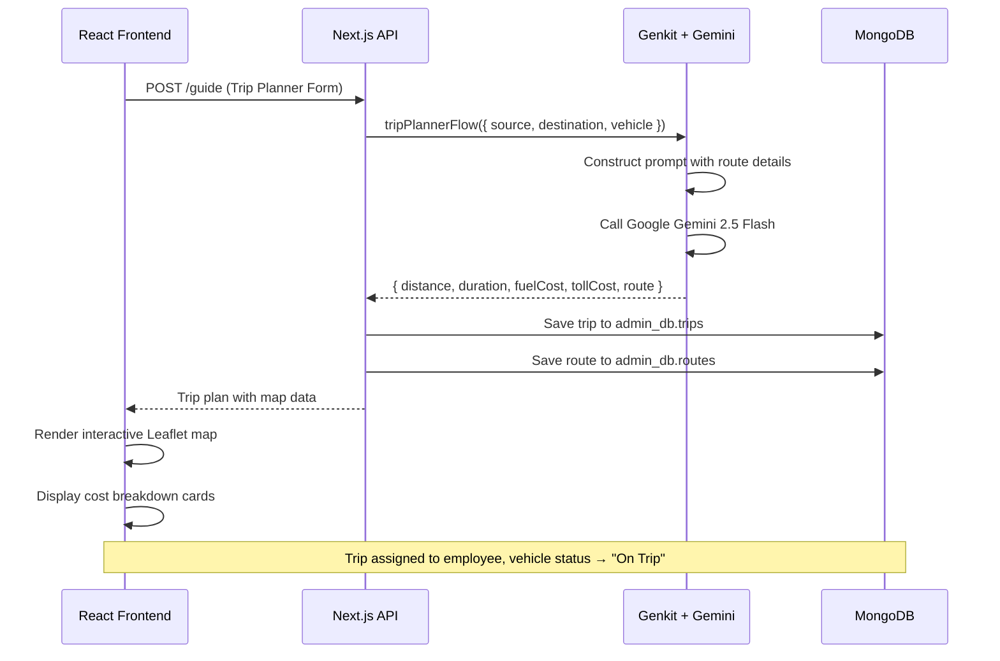

---

## 🗄️ Database Design

### **MongoDB Collections**

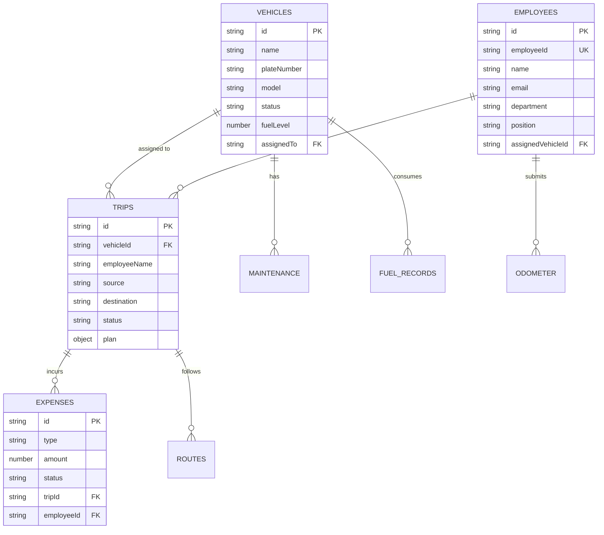

<table>
<tr>
<th>Admin Database (admin_db)</th>
<th>Employee Database (emp_db)</th>
</tr>
<tr>
<td>

- `vehicles` — Fleet vehicle records
- `trips` — Trip plans & tracking
- `routes` — Saved routes & emissions
- `admins` — Admin user accounts
- `fleet_settings` — System config
- `maintenance_records` — Service history
- `fuel_records` — Fuel consumption

</td>
<td>

- `employee_profiles` — Employee info
- `expenses` — Expense claims
- `odometer_readings` — Odometer photos
- `employee_trips` — Personal trips
- `emergency_contacts` — Safety contacts
- `reminders` — Notifications
- `employee_settings` — Preferences

</td>
</tr>
</table>

---

## 🔐 Security & Access Control

✅ **Role-Based Access:** Admin and Employee views with different permissions  
✅ **Admin Code Protection:** 6-digit admin code required for admin login  
✅ **No External Auth Dependency:** Self-contained authentication system  
✅ **Local Database:** MongoDB runs locally, no cloud exposure by default  
✅ **Input Validation:** Zod schema validation on all forms  
✅ **Dark/Light Themes:** System-aware theme with manual toggle  

---

## 🗺️ Roadmap

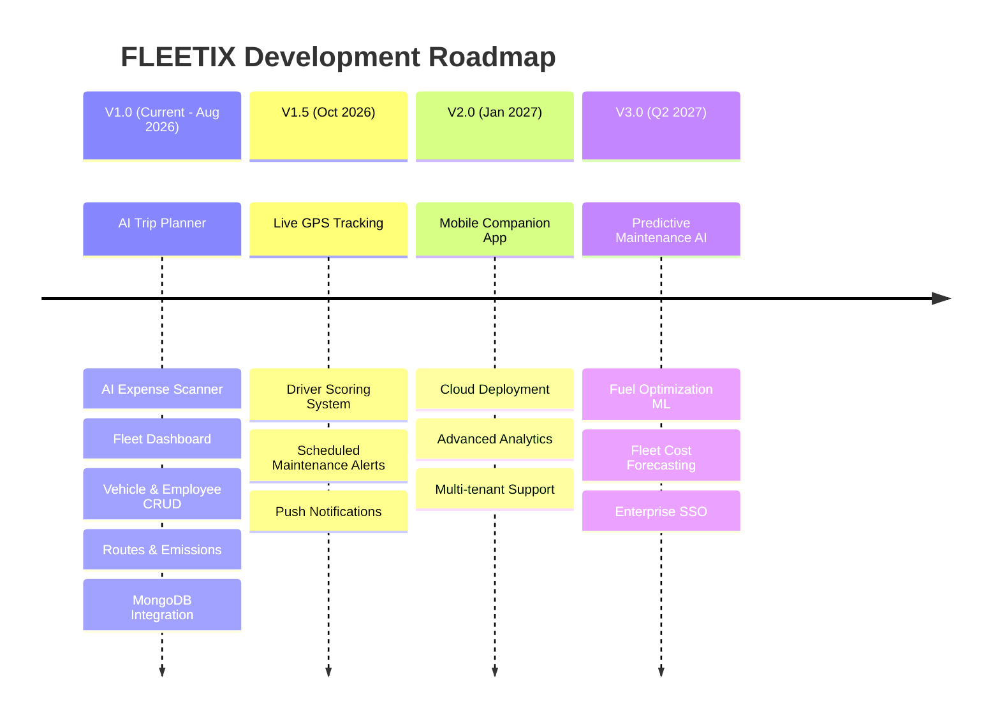

---

## 🤝 Contributing

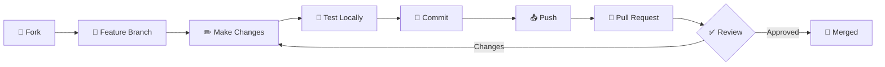

**We'd love your contributions!**

```bash
# Setup development environment
git clone https://github.com/tawfeeq-bahur/fleet_manager.git
cd fleet_manager
git checkout -b feature/your-feature-name

# Install & run
npm install
npm run dev

# Make changes, commit, push
git add .
git commit -m "feat: add new feature"
git push origin feature/your-feature-name

# Open pull request on GitHub
```

**Contribution Guidelines:**
- 🎯 One feature per pull request
- 📝 Clear commit messages following conventional commits
- ✅ Test before submitting
- 📖 Update documentation for new features
- 🎨 Follow the existing design system (ShadCN + Tailwind)

---

## 📞 Support & Community

<div align="center">

[](https://github.com/tawfeeq-bahur/fleet_manager/issues)
[](https://github.com/tawfeeq-bahur/fleet_manager/discussions)
[](mailto:tawfeeqbahur@gmail.com)
[](mailto:deepakjd122@gmail.com)

</div>

### **FAQ**

<details>
<summary><strong>Q: How do I get a Google AI API Key?</strong></summary>

**A:** Visit [Google AI Studio](https://aistudio.google.com/), sign in with your Google account, and generate an API key. Add it to your `.env.local` file as `GOOGLE_GENAI_API_KEY`.

</details>

<details>
<summary><strong>Q: Do I need MongoDB installed locally?</strong></summary>

**A:** Yes, FLEETIX uses MongoDB for data persistence. Install [MongoDB Community Edition](https://www.mongodb.com/try/download/community) and [MongoDB Compass](https://www.mongodb.com/products/compass) for a GUI. The app connects to `mongodb://localhost:27017` by default.

</details>

<details>
<summary><strong>Q: How does the AI Trip Planner work?</strong></summary>

**A:** The trip planner uses Google's Gemini 2.5 Flash model via the Genkit framework. You provide source, destination, vehicle details, and route conditions. The AI generates a comprehensive trip plan including distance, duration, fuel costs, toll estimates, suggested route, and points of interest — all displayed on an interactive map.

</details>

<details>
<summary><strong>Q: Can drivers log in with their plate number?</strong></summary>

**A:** Yes! Drivers can log in using their vehicle plate number (e.g., `TRK-001`), their employee ID (e.g., `EMP001`), or their assigned name. The password for all demo accounts is `123`.

</details>

<details>
<summary><strong>Q: Is the expense scanner accurate?</strong></summary>

**A:** The AI expense scanner uses Google Gemini's vision capabilities to parse receipt images. It extracts amounts, dates, and expense types with high accuracy. However, always review the parsed data before submitting — AI estimates should be verified.

</details>

<details>
<summary><strong>Q: Can I deploy this to production?</strong></summary>

**A:** Yes! FLEETIX includes an `apphosting.yaml` for Firebase App Hosting and works seamlessly with Vercel. For production, configure proper MongoDB Atlas credentials and secure your API keys.

</details>

---

## 📊 Project Statistics

<div align="center">

| Metric | Value |
|--------|-------|
| 📁 **Total Source Files** | 60+ |
| ⚛️ **React Components** | 25+ |
| 🔌 **API Endpoints** | 20+ |
| 🤖 **AI Flows** | 5 (Trip Planner, Expense Parser, Geocoder, Road Snapper, Insights) |
| 🗄️ **Database Collections** | 14 |
| 📱 **App Pages** | 14 |
| 🎨 **UI Components (ShadCN)** | 30+ |
| ⚡ **Dev Server Port** | 9002 |
| 🧪 **Type Safety** | Full TypeScript coverage |
| 🌙 **Theme Support** | Light + Dark + System |

</div>

---

## 📜 License & Credits

**License:** MIT License

---

<div align="center">

### **Built by**

**[Tawfeeq Bahur (7afe)](https://www.linkedin.com/in/tawfeeqb/)** & **[Deepak J (JD)](https://www.linkedin.com/in/deepak-j-1206hd/)**

📧 tawfeeqbahur@gmail.com • deepakjd122@gmail.com

**With:** Next.js + React + Genkit + Google Gemini + MongoDB + ❤️

---

### ⭐ Star this repository if you found it helpful!

**It takes 2 seconds but means the world to us.**

[](https://github.com/tawfeeq-bahur/fleet_manager)
[](https://github.com/tawfeeq-bahur/fleet_manager)
[](https://github.com/tawfeeq-bahur/fleet_manager)

---

### Built with ❤️ for smarter fleet management

**AI-powered logistics. Real-time insights. Zero guesswork.**

[⬆ Back to Top](#-fleetix)

</div>
